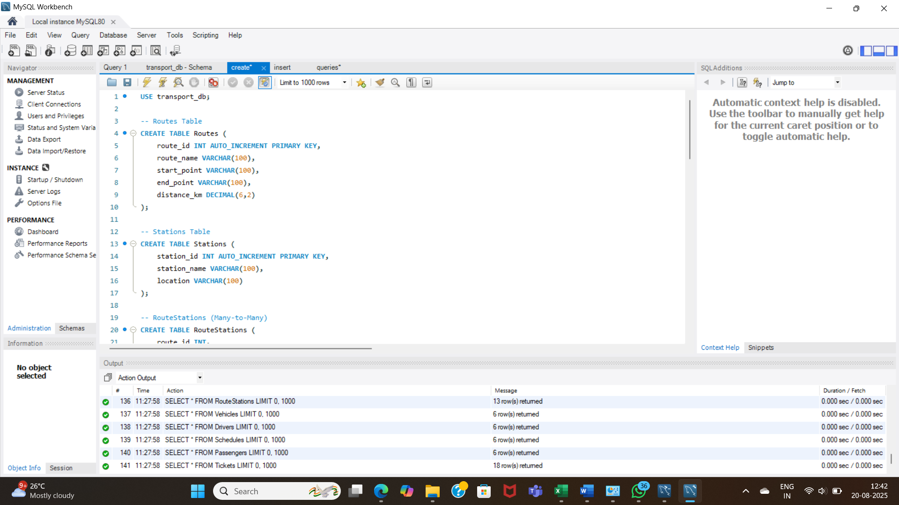
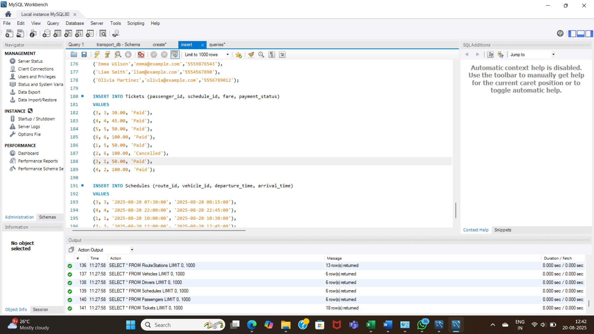
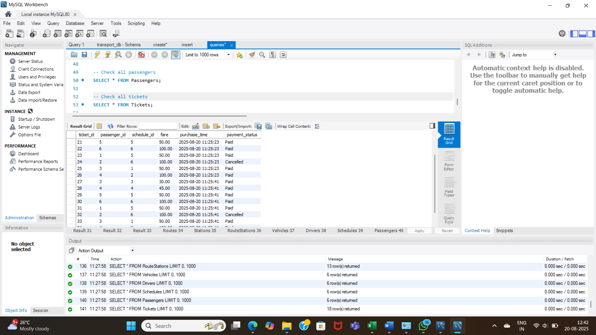
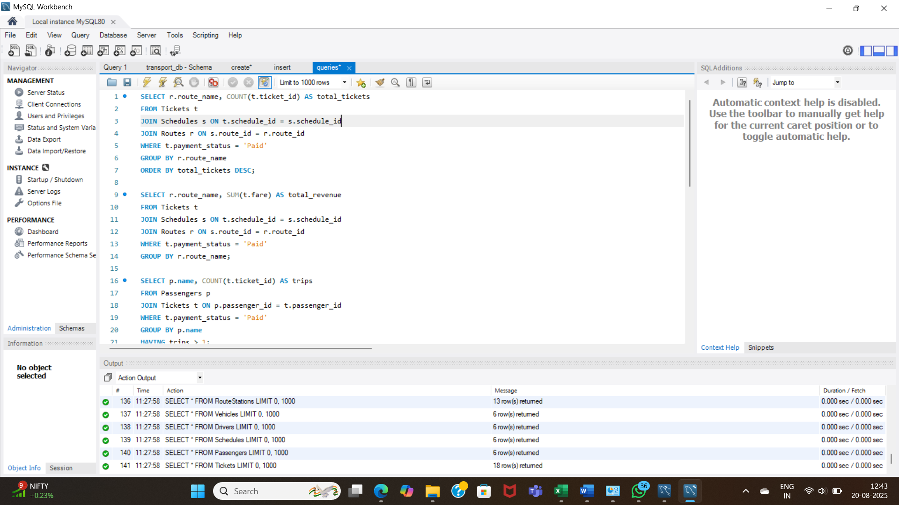

# PublicTransportationSQL

## 🚆 Project Overview

This project simulates a **city public transportation system** using a MySQL database. It allows tracking of:  

- **Routes** and their corresponding **stations**  
- **Vehicles** and **drivers**  
- **Schedules** for departures and arrivals  
- **Passengers** and **tickets**  

The goal is to showcase **SQL skills** in database design, data insertion, queries, and analytics, while solving real-world transit management problems.  

---

## 🗂 Database Schema / ER Diagram

The database is organized into the following tables:

1. **Routes** – Contains route details including start & end points, distance, and route name.  
2. **Stations** – Lists all stations in the transit network.  
3. **RouteStations** – Links stations to routes with a specific stop order.  
4. **Vehicles** – Stores vehicles assigned to routes, including type and capacity.  
5. **Drivers** – Information about drivers and the vehicles they are assigned to.  
6. **Schedules** – Departure and arrival times of vehicles on routes.  
7. **Passengers** – Stores passenger information such as name, email, and phone.  
8. **Tickets** – Tracks ticket purchases, fares, and payment status.  

**ER Diagram:**  
You can generate a visual ER diagram in **MySQL Workbench** or use **draw.io**. Save it in the `screenshots/` folder for reference.  

---

## 📝 Tables Description

| Table Name       | Description                                                                 |
|-----------------|-----------------------------------------------------------------------------|
| Routes           | Defines each route with start/end points and distance.                     |
| Stations         | Contains station names and locations.                                      |
| RouteStations    | Associates stations to routes and their order in the route.                |
| Vehicles         | Information about vehicles, capacity, and assigned route.                  |
| Drivers          | Drivers assigned to specific vehicles.                                      |
| Schedules        | Timings of vehicle departures and arrivals on each route.                 |
| Passengers       | Passenger personal information.                                            |
| Tickets          | Tracks which passenger booked which schedule, fare, and payment status.   |

---

## 🔍 Sample Queries

The project includes **professional SQL queries** demonstrating real-world analytics:

1. **Busiest Route** – Count tickets sold per route:

```sql
SELECT r.route_name, COUNT(t.ticket_id) AS tickets_sold
FROM Tickets t
JOIN Schedules s ON t.schedule_id = s.schedule_id
JOIN Routes r ON s.route_id = r.route_id
GROUP BY r.route_name
ORDER BY tickets_sold DESC;

```
2.**Passenger Count per vehicle** -  Find the number of passengers assigned to each vehicle:
```sql
SELECT v.vehicle_id, v.vehicle_type, COUNT(t.ticket_id) AS passenger_count
FROM Vehicles v
JOIN Schedules s ON v.vehicle_id = s.vehicle_id
JOIN Tickets t ON s.schedule_id = t.schedule_id
GROUP BY v.vehicle_id, v.vehicle_type
ORDER BY passenger_count DESC;
```

3. **Revenue per Route** - Calculate total revenue generated for each route:
```sql
SELECT r.route_name, SUM(t.fare) AS total_revenue
FROM Tickets t
JOIN Schedules s ON t.schedule_id = s.schedule_id
JOIN Routes r ON s.route_id = r.route_id
GROUP BY r.route_name
ORDER BY total_revenue DESC;
```
5. **Schedules with Available Seats** - Find schedules that still have available seats:
```sql
SELECT s.schedule_id, r.route_name, v.vehicle_type, (v.capacity - COUNT(t.ticket_id)) AS available_seats
FROM Schedules s
JOIN Vehicles v ON s.vehicle_id = v.vehicle_id
JOIN Routes r ON s.route_id = r.route_id
LEFT JOIN Tickets t ON s.schedule_id = t.schedule_id
GROUP BY s.schedule_id, r.route_name, v.vehicle_type, v.capacity
HAVING available_seats > 0;
```
---

## ⚡ How to Run

1. **Clone the repository:**

```bash
git clone https://github.com/yourusername/PublicTransportationSQL.git
cd PublicTransportationSQL
```
2. **Open MySQL Workbench and connect to your MySQL server.**

3. **Create the database:**
   ```bash
     CREATE DATABASE transport_db;
     USE transport_db;
     ```

4. **Load the schema (tables):**
    ```bash
    SOURCE path/to/schema.sql;
    ```
5. **Insert sample data:**
   ```bash

    SOURCE path/to/sample_data.sql;
   ```

6.**Run the queries:**
```bash

    SOURCE path/to/queries.sql;
```
---
## 📷 Outputs

### Screenshot 1


### Screenshot 2


### Screenshot 3


### Screenshot 4



